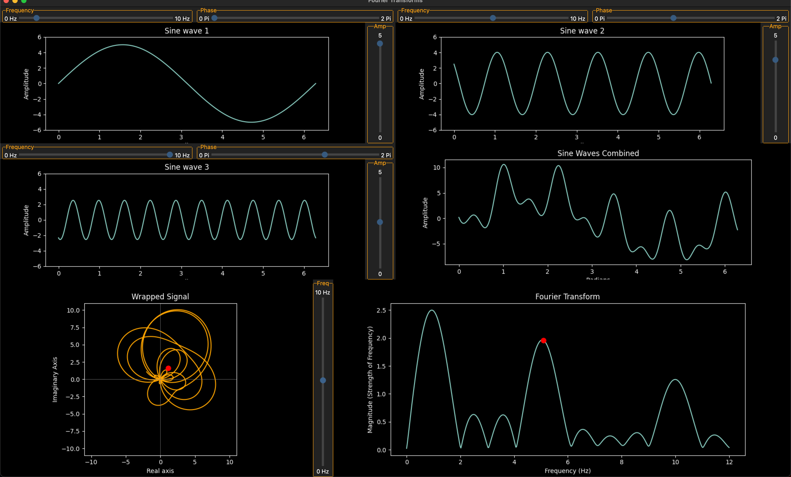

# fourier-transforms

Visualization gui for fourier transformations

Heavily inspired by a 3 Blue 1 Brown [video](https://www.youtube.com/watch?v=spUNpyF58BY) on the topic. It's well worth a watch!

A visualization to for sinusoid wave forms and fourier transforms.
The gui is made up of 6 six interacive plots. The first three plots allow
you to create sinusoid waves with varying frequency, phase shift, and amplitude.
The next plot allows you to visualize adding the three sinusoids together.

The last two plots help to visualize the fourier transform, going from the
time domain to the frequency domain. The first plot here allows you to visualize
the math behind the fourier tranform by wrapping
the sinusoid around a circle at a given, varying, frequency and plotting the 1mean of the signal.
The last plot is the output of the 2fourier transform itself, also mapping
the mean point from the previous plot over to show the correlation.

1 The mean is used here instead of the sum solely for plotting puposes. The sum makes the 
plotting boundaries to large in most cases to fully appreciate the wrapped signal.

2 This isn't the output of a traditional fourier transform or fft. Again, becuase the mean is used instead of the sum, but also because I wanted a higher bin resolution for frequecies between 0 Hz and 10 Hz. So I used a custom range of frequecies for better bin resolution.

## Installation and Dependencies

This project depends on `numpy`, `matplotlib` and `ttkbootstrap`.
Install from `pyproject.toml`, `poetry.lock`, or directly with `pip`:

`pip install numpy`
`pip install matplotlib`
`pip install ttkbootstrap`

## Running

To run the gui, simply run the `main.py` file:

`python3 main.py`

I hope you enjoy!
